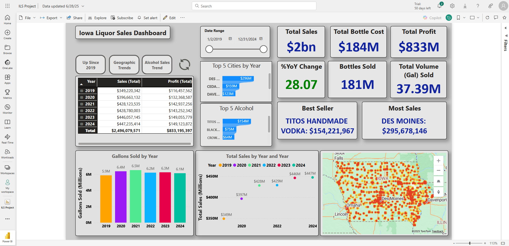

# ILS-Project
This is a personal project I developed out of curiosity and desire to improve my data analytics skills.

Final dashboard, cleaned dataset, cleaning process with annotations in python, all queries performed in SQL (SSMS), measures were created in DAX to illustrate the findings succintly within a dashboard in PowerBI.

The data was downloaded free of charge from https://data.iowa.gov/Sales-Distribution/Iowa-Liquor-Sales/m3tr-qhgy/about_data and was provided by the Iowa Department of Revenue, Alcoholic Beverages.

The initial dataset contained approximately 31M rows of single line alcohol transactions from 2012-2025. I chose to cull the dataset to only transactions beginning in 2019 and on leaving me with ~16M transactions to clean and analyze.

Cleaning involved removing duplicates (of which there were none), filling in or handling missing values (approx 1.4M, mostly from store location and county number), reconciling column d.types, and parsing the 'Point (Longitutde, Latitude)' format into useable coordinates.

Querying the data provided insights into popular brands, volume consumption over the years, total sales, and consumption by city.

When studying alcohol trends and sales it's important to understand consumption vs price and spendature. While sales increased by 28% since 2019, it seems consumption only increased by 3%. Further analysis into average pricing would be an interesting topic for 
further analysis.

Overall this project was helpful in allowing me to flex the analytic and visualization skills I developed during my time in a data analytics bootcamp as well as in my personal time.
